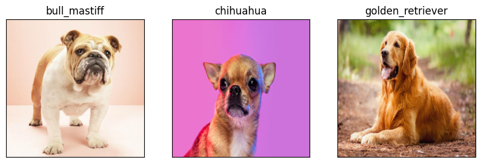

# K9 Vision 🐶

## Technology Used

In this project, I utilized the following technologies:

- **Python**: The primary programming language used for development.
- **TensorFlow 2.x**: Deep learning framework for building and training machine learning models.
- **TensorFlow Hub**: Repository for reusable machine learning modules, including pre-trained models.
- **Google Colab**: Cloud-based platform for running Python code using Jupyter notebooks.

## Kaggle Competition

We are participating in the [Dog Breed Identification](https://www.kaggle.com/c/dog-breed-identification/overview) competition on Kaggle. You can find more information about the competition and its overview [here](https://www.kaggle.com/c/dog-breed-identification/overview).

## Results on Real-World Images

Here a result from our deep learning models applied to real-world images:

